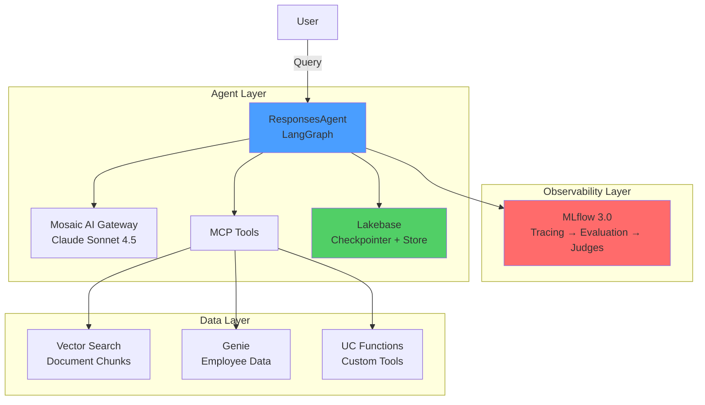

# Databricks Agent Bootcamp

A hands-on tutorial series for building production-ready AI agents on Databricks. Build an **Internal Knowledge Assistant** that answers employee questions using Vector Search (documents) and Genie (structured data), with conversation memory powered by Lakebase.

**Target Audience:** Developers familiar with LangChain/agents but new to Databricks
**Duration:** 2 hours hands-on
**Level:** Intermediate

---

## 🏗️ Architecture



---

## 📚 Learning Path

### Module 0: Foundations (45 min)
Build a solid understanding of the Databricks platform.

| Notebook | Topics | Duration |
|----------|--------|----------|
| [00_setup.py](00_foundations/00_setup.py) | Unity Catalog, Lakebase, Sample Data | 15 min |
| [01_mosaic_gateway.py](00_foundations/01_mosaic_gateway.py) | LLM Endpoints, Pay-per-token vs Provisioned | 10 min |
| [02_platform_orientation.py](00_foundations/02_platform_orientation.py) | MCP, Unity Catalog, ResponsesAgent | 15 min |

**You'll learn:** Platform concepts, governance model, why MCP matters

---

### Module 1: RAG Pipeline (45 min)
Build your first document-based Q&A agent.

| Notebook | Topics | Duration |
|----------|--------|----------|
| [01_data_prep.py](01_rag_pipeline/01_data_prep.py) | Document chunking, Delta tables | 15 min |
| [02_vector_index.py](01_rag_pipeline/02_vector_index.py) | Delta Sync Vector Search, embeddings | 20 min |
| [03_vector_search_mcp.py](01_rag_pipeline/03_vector_search_mcp.py) | MCP client, governed tools | 10 min |
| [driver_01.py](01_rag_pipeline/driver_01.py) | **RAG Agent with Vector Search** | 15 min |

**You'll build:** Agent that answers policy questions from documents

---

### Module 2: Memory (60 min)
Add conversation memory for multi-turn interactions.

| Notebook | Topics | Duration |
|----------|--------|----------|
| [01_lakebase_autoscaling.py](02_memory/01_lakebase_autoscaling.py) | Lakebase projects, branches, scale-to-zero | 15 min |
| [02_checkpointer.py](02_memory/02_checkpointer.py) | PostgresSaver, thread-based memory | 20 min |
| [03_long_term_store.py](02_memory/03_long_term_store.py) | PostgresStore, user preferences | 20 min |
| [driver_02.py](02_memory/driver_02.py) | **Agent with Memory** | 15 min |

**You'll build:** Agent with multi-turn conversations and persistent state

---

### Module 3: Evaluation (60 min)
Implement observability and evaluation.

| Notebook | Topics | Duration |
|----------|--------|----------|
| [01_tracing.py](03_evaluation/01_tracing.py) | MLflow tracing, span analysis | 15 min |
| [02_builtin_scorers.py](03_evaluation/02_builtin_scorers.py) | Correctness, Groundedness, Guidelines | 20 min |
| [03_make_judge.py](03_evaluation/03_make_judge.py) | Custom judges, Literal types | 15 min |
| [04_agent_as_judge.py](03_evaluation/04_agent_as_judge.py) | Trace analysis, tool optimization | 15 min |
| [05_judge_alignment.py](03_evaluation/05_judge_alignment.py) | Human feedback, judge alignment | 20 min |
| [driver_03.py](03_evaluation/driver_03.py) | **Full Evaluation Pipeline** | 15 min |

**You'll build:** Comprehensive evaluation framework with scorers and judges

---

### Module 4: MCP Tool Integration (75 min)
Learn how to add data query capabilities and custom tools to your agents.

| Notebook | Topics | Duration |
|----------|--------|----------|
| [01_genie_integration.py](04_mcp_tool_integration/01_genie_integration.py) | Genie spaces, natural language SQL, multi-tool agents | 45 min |
| [02_custom_tools.py](04_mcp_tool_integration/02_custom_tools.py) | Custom tools, MCP servers, advanced patterns | 30 min |

**You'll build:** Agent with multiple tools (Vector Search + Genie + custom tools) that intelligently routes between documentation, data queries, and external APIs

---

### Module 5: Deployment (45 min)
Deploy your agent to production.

| Notebook | Topics | Duration |
|----------|--------|----------|
| [01_logging.py](05_deployment/01_logging.py) | MLflow logging, UC model registry | 15 min |
| [02_serving.py](05_deployment/02_serving.py) | agents.deploy(), REST API testing | 15 min |
| [03_production_monitoring.py](05_deployment/03_production_monitoring.py) | Inference tables, online evaluation | 15 min |
| [driver_05.py](05_deployment/driver_05.py) | **End-to-End Deployment** | 15 min |

**You'll build:** Production-ready agent with monitoring

---

## 🚀 Quick Start

### Prerequisites

**Databricks Workspace:**
- **Databricks Runtime:** MLR 17.3 LTS or higher
- Unity Catalog enabled
- Lakebase access
- Genie access
- Foundation Model endpoints available

**Permissions:**
- Create catalogs/schemas
- Create Vector Search indexes
- Create Lakebase projects
- Deploy to Model Serving

**Knowledge:**
- Python programming
- Basic LangChain/LangGraph concepts
- Familiarity with agents (ReAct pattern)

### Setup Instructions

**⚠️ CRITICAL: Follow these steps in order!**

1. **Clone the repository to your Databricks workspace:**
   ```bash
   git clone https://github.com/your-org/databricks_agent_bootcamp
   cd databricks_agent_bootcamp
   ```

2. **🔧 FIRST: Install required packages (5 minutes)**
   - **Open and run:** [00_INSTALL_REQUIREMENTS.py](00_INSTALL_REQUIREMENTS.py)
   - This notebook installs MLflow 3.x, LangGraph, databricks-mcp, and other dependencies
   - **Why?** MLR 17.3 LTS includes MLflow 2.x, but this bootcamp requires MLflow 3.x for ResponsesAgent
   - **Wait for completion** before proceeding

3. **Update configuration in [config.py](config.py):**
   ```python
   CATALOG = "agent_bootcamp"           # Your catalog name
   SCHEMA = "knowledge_assistant"       # Your schema name
   HOST = "https://your-workspace.cloud.databricks.com"
   REGION = "us-west-2"                 # Your cloud region
   ```

4. **Run the setup notebook:**
   - Open [00_foundations/00_setup.py](00_foundations/00_setup.py)
   - Run all cells to create Unity Catalog assets and sample data

5. **Follow the learning path:**
   - Start with Module 0 (Foundations)
   - Progress through modules sequentially
   - Each "driver" notebook demonstrates the complete agent

---

## 🧰 Tech Stack

| Component | Technology | Purpose |
|-----------|-----------|---------|
| **Agent Framework** | MLflow ResponsesAgent + LangGraph | Agent orchestration and execution |
| **LLM** | Mosaic AI Gateway (Claude Sonnet 4.5) | Reasoning and generation |
| **Vector Search** | Databricks Vector Search (Delta Sync) | Document similarity search |
| **Structured Data** | Genie | Natural language to SQL |
| **Memory** | Lakebase (PostgreSQL) | Conversation state (checkpointer + store) |
| **Observability** | MLflow 3.0 | Tracing, evaluation, judges |
| **Governance** | Unity Catalog | Permissions, audit logs |
| **Deployment** | Databricks Model Serving | Production serving endpoint |

---

## 📖 Key Concepts

### ResponsesAgent
MLflow's recommended agent base class with:
- OpenAI Responses API compatibility
- Multi-agent orchestration support
- Advanced streaming with events
- Thread-based conversation management

### Model Context Protocol (MCP)
Databricks' standard for exposing services as agent tools:
- **Vector Search MCP**: Governed similarity search
- **Genie MCP**: Natural language to SQL
- **UC Functions MCP**: Execute registered functions

**Why MCP?** Unity Catalog permissions flow through automatically.

### Lakebase
Managed PostgreSQL with:
- **Autoscaling**: Scale-to-zero after 15 min idle
- **Branching**: Copy-on-write branches (like Git)
- **Checkpointer**: Short-term conversation memory
- **Store**: Long-term facts and preferences

### MLflow 3.0 Evaluation
- **Scorers**: Built-in (Correctness, Groundedness, Guidelines)
- **make_judge()**: Create custom judges with natural language
- **Agent-as-a-Judge**: Analyze traces with `{{ trace }}` variable
- **Judge Alignment**: Align judges with human feedback (DSPy-SIMBA)

---

## 🎯 What You'll Build

By the end of this bootcamp, you'll have built a production-ready **Internal Knowledge Assistant** that:

✅ Answers policy questions from documents (Vector Search)
✅ Queries employee data (Genie)
✅ Maintains conversation context (Lakebase checkpointer)
✅ Remembers user preferences (Lakebase store)
✅ Traces all execution (MLflow)
✅ Evaluates quality (Scorers + Judges)
✅ Deploys to production (Model Serving)
✅ Monitors in real-time (Inference tables)

---

## 📦 Project Structure

```
databricks_agent_bootcamp/
├── config.py                       # Shared configuration
├── src/
│   └── agent.py                    # ResponsesAgent implementation
│
├── 00_foundations/                 # Platform basics
├── 01_rag_pipeline/                # Vector Search + documents
├── 02_memory/                      # Lakebase checkpointing
├── 03_evaluation/                  # MLflow judges + scorers
├── 04_genie/                       # Structured data queries
└── 05_deployment/                  # Production serving
```

---

## 🔧 Dependencies

Install required packages:

```python
%pip install -q \
  mlflow[databricks]>=3.1 \
  databricks-sdk \
  databricks-langchain \
  databricks-agents>=1.0 \
  databricks-mcp \
  langgraph \
  langgraph-checkpoint-postgres \
  langchain-core \
  psycopg[binary]
```

---

## 🌟 Best Practices

### Development
- Use **development branch** in Lakebase for testing
- Enable **MLflow tracing** for all agent calls
- Test with **small eval datasets** first

### Production
- Deploy to **provisioned throughput** endpoints
- Enable **inference tables** for monitoring
- Use **connection pooling** (min_size=2) to avoid cold starts
- Configure **online evaluation** for quality monitoring

### Security
- Always use **MCP tools** (not direct SDK) for governance
- Grant **minimal permissions** via Unity Catalog
- Store secrets in **Databricks Secrets**
- Enable **audit logging** for compliance

---

## 🆘 Troubleshooting

### Common Issues

**Vector Search index not syncing**
- Check that source Delta table has data
- Verify embedding endpoint is available
- Wait for index state: `ONLINE`

**Lakebase connection timeout**
- First connection after idle has 20-30s cold start
- Use connection pooling (min_size >= 2) to keep warm

**MCP tools not found**
- Verify MCP URL format is correct
- Check Unity Catalog permissions on underlying assets
- Ensure authentication token has required scopes

**Agent not using tools**
- Check that tools are bound to LLM: `llm.bind_tools(tools)`
- Verify tool descriptions are clear and specific
- Review traces to see LLM reasoning

---

## 📚 Additional Resources

- [Databricks Agent SDK Documentation](https://docs.databricks.com/agent-sdk/)
- [MLflow 3.0 Evaluation Guide](https://mlflow.org/docs/latest/evaluation/)
- [LangGraph Documentation](https://langchain-ai.github.io/langgraph/)
- [Unity Catalog Best Practices](https://docs.databricks.com/data-governance/unity-catalog/)

---

## 🤝 Contributing

Issues and pull requests welcome! Please follow these guidelines:
- Test all notebooks before submitting
- Update README for significant changes
- Follow Databricks notebook format conventions

---

## 📄 License

This project is licensed under the MIT License - see LICENSE file for details.

---

## 🎓 Next Steps

After completing this bootcamp:

1. **Customize for your use case:**
   - Add domain-specific documents
   - Create custom UC Functions
   - Tune evaluation criteria

2. **Explore advanced patterns:**
   - Multi-agent orchestration
   - Human-in-the-loop workflows
   - Custom rerankers

3. **Scale to production:**
   - Load testing and optimization
   - Multi-region deployment
   - Compliance and security hardening

---

**Happy Building! 🚀**

For questions or feedback, please open an issue or contact the Databricks Agent team.
