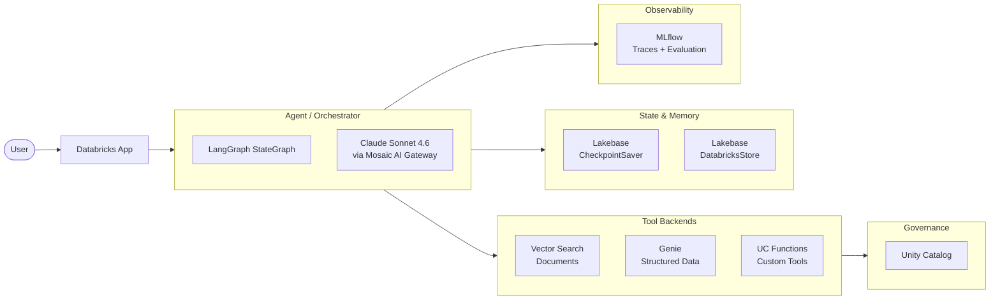

# Architecture

The Knowledge Assistant is a LangGraph agent with multiple tool backends, all governed through Unity Catalog.

---

## System diagram



---

## How the agent works

1. User sends a message to the Databricks App endpoint
2. The app loads conversation state from CheckpointSaver (short-term memory)
3. The LLM decides which tools to call based on the question
4. Tool results flow back through the LLM for synthesis
5. The response is returned and state is checkpointed
6. MLflow traces the entire execution

---

## Tool routing

The agent uses the ReAct pattern — the LLM decides which tool to use on each turn:

| Question type | Tool used | Example |
|---|---|---|
| Policy / document question | Vector Search MCP | "What's our remote work policy?" |
| Data / metrics question | Genie MCP | "How many days of leave does Alice have?" |
| Lookup by ID | UC Functions MCP | "Get employee details for E1234" |
| Memory recall | `get_user_memory` | "What's my preferred name?" |
| General conversation | No tool (direct LLM) | "Thanks, that's helpful" |

---

## Memory architecture

| Type | Backend | Scope | Key | Lifetime |
|---|---|---|---|---|
| Short-term | Lakebase CheckpointSaver | One conversation | `thread_id` | Minutes to hours |
| Long-term | Lakebase DatabricksStore | Cross-session | `user_id` | Days to years |

Long-term memory is managed by three tools the agent calls autonomously:

- `get_user_memory` — semantic search over stored facts
- `save_user_memory` — persist a new fact
- `delete_user_memory` — remove a fact (GDPR)

---

## MCP integration

All tool access goes through Databricks MCP servers. Unity Catalog permissions flow through automatically.

```
{HOST}/api/2.0/mcp/vector-search/{CATALOG}/{SCHEMA}
{HOST}/api/2.0/mcp/genie/{GENIE_SPACE_ID}
{HOST}/api/2.0/mcp/functions/{CATALOG}/{SCHEMA}
```

---

## Deployment topology

```
apps/knowledge_assistant_agent/
├── app.yaml                    # Env vars, runtime config
├── requirements.txt            # Python deps
├── static/index.html           # Chat UI
└── agent_server/
    ├── agent.py                # @invoke / @stream handlers
    ├── langgraph_agent.py      # KnowledgeAssistant class
    ├── start_server.py         # AgentServer bootstrap
    └── utils_memory.py         # Memory helpers
```

Deploy with:
```bash
databricks sync "apps/knowledge_assistant_agent" "/Users/$USER/app"
databricks apps deploy knowledge-assistant-agent-app \
  --source-code-path "/Workspace/Users/$USER/app"
```
