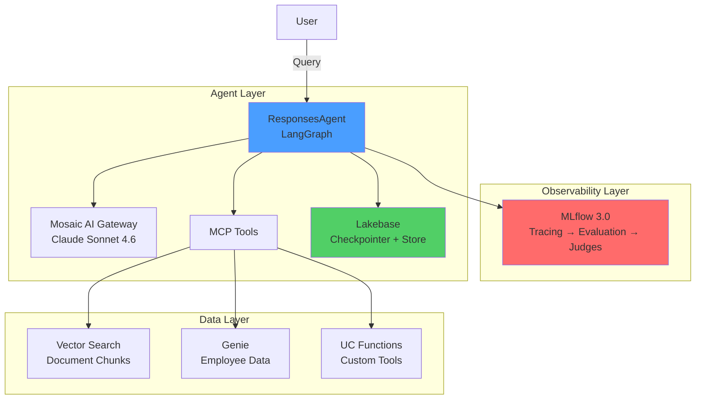

# Architecture

## System Overview

The bootcamp builds a three-layer system: an **agent layer** for orchestration, a **data layer** for retrieval and queries, and an **observability layer** for tracing and evaluation.

## Agent Layer

### LangGraph StateGraph

The agent uses LangGraph's `StateGraph` with `MessagesState` for the conversation loop:

1. User sends a message
2. LLM decides whether to call a tool or respond directly
3. If a tool is needed, the `ToolNode` executes it
4. The LLM processes tool output and responds (or calls another tool)

This is the standard ReAct pattern, implemented with LangGraph's conditional edges.

### MCP Tools

All data access goes through Databricks MCP (Model Context Protocol) servers. This means Unity Catalog permissions flow through automatically — no separate authorization needed.

| MCP Server | Purpose | Underlying Service |
|---|---|---|
| Vector Search MCP | Document similarity search | Databricks Vector Search |
| Genie MCP | Natural language to SQL | Genie Spaces |
| UC Functions MCP | Execute governed functions | Unity Catalog Functions |

### Memory

Memory lives in Lakebase (managed PostgreSQL):

- **CheckpointSaver** — short-term memory scoped to a `thread_id` (one conversation)
- **DatabricksStore** — long-term memory scoped to a `user_id` (cross-session facts and preferences)

The agent manages long-term memory through three tools: `get_user_memory`, `save_user_memory`, and `delete_user_memory`.

## Data Layer

### Vector Search (Documents)

Documents are chunked and stored in a Delta table, then synced to a Vector Search index via Delta Sync. The agent uses `VectorSearchRetrieverTool` for similarity search.

### Genie (Structured Data)

Genie converts natural language to SQL. You create a Genie Space pointing at your tables, and the agent queries it through the Genie MCP server.

### UC Functions (Custom Tools)

Unity Catalog functions wrap custom Python logic as governed tools. The agent calls them through the UC Functions MCP server.

## Observability Layer

### MLflow Tracing

Every agent invocation produces a trace with spans for:

- LLM calls (inputs, outputs, token counts)
- Tool calls (arguments, results, latency)
- Memory operations
- End-to-end timing

### Evaluation

Three types of scorers assess agent quality:

| Type | Example | Cost |
|---|---|---|
| Built-in LLM judge | `Safety()`, `Correctness()`, `Guidelines()` | LLM call per trace |
| Custom LLM judge | `make_judge(name=..., instructions=...)` | LLM call per trace |
| Code-based scorer | `@scorer` decorated function | Free (Python only) |

Scorers can run in batch during development or continuously in production via registered scorers with configurable sampling rates.

## Deployment

The agent deploys as a **Databricks App** with:

- `databricks sync` to push source code to workspace files
- `databricks apps deploy` to launch the app
- `/invocations` endpoint for API access
- Built-in chat UI at `GET /`
- MLflow traces written to a shared experiment for monitoring
